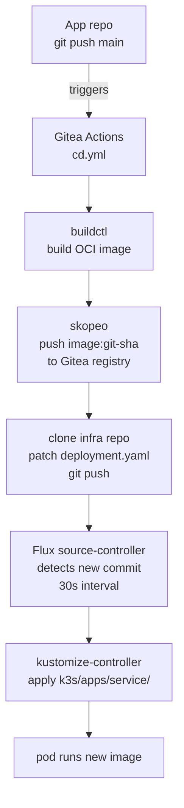
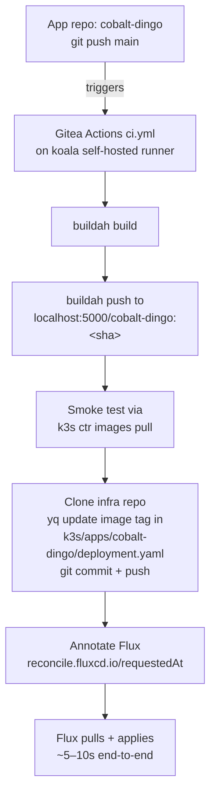

# CD pipeline

GitOps CD pipeline for services running in the koala k3s cluster.

## Architecture



## Components on koala

### BuildKit (`buildkitd`)

Builds container images without Docker. Runs as a root systemd service.

- **Socket**: `/run/buildkit/buildkitd.sock` (root-only)
- **Config**: `/etc/buildkit/buildkitd.toml`
- **Manage**: `systemctl [start|stop|status] buildkitd`

Registry auth for pushing is in `/root/.docker/config.json`.

### skopeo

Pushes OCI image tarballs to the Gitea container registry. Uses `--dest-creds` for simple basic auth (avoids OAuth token flow). Already installed at `/usr/bin/skopeo`.

### claude CLI

Installed globally at `/usr/bin/claude`. Used by the supervisor container at runtime (the supervisor shells out to `claude --print` for skill execution). Also available for agentic automation tasks on koala.

API keys are in `/etc/environment` (loaded by PAM for all sessions including SSH).

## Gitea registry

Images are tagged with the full git SHA: `gitea.d-ma.be/mathias/<repo>:<sha>`.

Registry credentials:
- Push token: set as `REGISTRY_CREDS` org secret in Gitea (`mathias:<token>`)
- Pull secret: SOPS-encrypted in `k3s/apps/imagepullsecret/secret.enc.yaml`, applied to each app namespace as `gitea-registry` imagePullSecret

## Flux GitOps

Flux is bootstrapped to watch this repo at `k3s/flux/`. Two Kustomizations:

| Name | Path | Role |
|------|------|------|
| `flux-system` | `k3s/flux/` | Flux itself |
| `apps` | `k3s/apps/` | All app services |

The `apps` Kustomization has SOPS decryption enabled (reads age key from `sops-age` Secret in `flux-system` namespace).

### Adding a new service

1. Create `k3s/apps/<service>/` with `namespace.yaml`, `deployment.yaml`, `service.yaml`, `kustomization.yaml`, `secrets.enc.yaml`
2. Add `- <service>` to `k3s/apps/kustomization.yaml`
3. Add a `cd.yml` to the app's repo (same pattern as supervisor)
4. Set `REGISTRY_CREDS` and `INFRA_DEPLOY_KEY` org secrets in Gitea (already set — inherited by all repos)
5. Encrypt app secrets with SOPS: `sops --encrypt secrets.yaml > secrets.enc.yaml`

### Rollback

```bash
# In this repo:
git revert <tag-commit>
git push
# Flux reconciles within 60s — pod rolls back to previous image
```

## Cobalt-dingo — local-registry variant

`cobalt-dingo` uses a different CD flow because the build/push happens on
the koala self-hosted Gitea Actions runner directly:



Differences from the supervisor pattern above:
- Builder: **buildah** instead of buildctl
- Registry: **localhost:5000** (in-cluster, see `docs/registries.md`) instead of `gitea.d-ma.be`
- Smoke test: in-CI via `k3s ctr` before deploy
- Deploy: still goes through infra-repo + Flux (since v0.2.0); Flux is
  triggered immediately via `kubectl annotate` so reconcile starts in <1s

### Flux reconcile intervals (tuned for fast deploys)

| Resource | Default | Configured | Why |
|---|---|---|---|
| `GitRepository/flux-system` | 1m | **10s** | Polling Gitea cheaply for fast pickup |
| `Kustomization/apps` | 10m | **30s** | Quick reconcile if annotate misses |
| `Kustomization/flux-system` | 10m | 10m | Flux itself rarely changes |

CI pipelines should still annotate Flux for immediate reconciliation rather
than relying on the polling interval. See the `cobalt-dingo` workflow.

## SOPS + age

Secrets are encrypted with age before committing. The age public key is in `.sops.yaml`. The private key is stored only in the `sops-age` k8s Secret in the `flux-system` namespace — it must be backed up externally (1Password).

**Encrypt a secret:**
```bash
sops --encrypt secret.yaml > secret.enc.yaml
```

**Decrypt for inspection (requires age private key):**
```bash
# Export key from cluster first:
kubectl get secret sops-age -n flux-system -o jsonpath='{.data.age\.agekey}' | base64 -d > /tmp/age.key
SOPS_AGE_KEY_FILE=/tmp/age.key sops --decrypt secret.enc.yaml
shred -u /tmp/age.key
```

## Environment variables on koala

API keys and config are in `/etc/environment` (loaded by PAM — available to all sessions including SSH and the Gitea runner). After a reinstall, restore these manually:

| Variable | Purpose |
|----------|---------|
| `ANTHROPIC_API_KEY` | Claude API — used by supervisor container and claude CLI |
| `DMABE_LLMAPI_KEY` | LiteLLM gateway key (`sk-...`) — used by supervisor and other clients |
| `GEMINI_API_KEY` | Google Gemini |
| `MISTRAL_API_KEY` | Mistral |
| `BERGET_API_KEY` | berget.ai inference |

Values are in 1Password.

## Gitea org secrets

Set at `https://gitea.d-ma.be/org/mathias/settings/secrets` — inherited by all repos:

| Secret | Purpose |
|--------|---------|
| `REGISTRY_CREDS` | `mathias:<token>` for pushing to Gitea container registry |
| `INFRA_DEPLOY_KEY` | SSH private key with write access to this infra repo |
