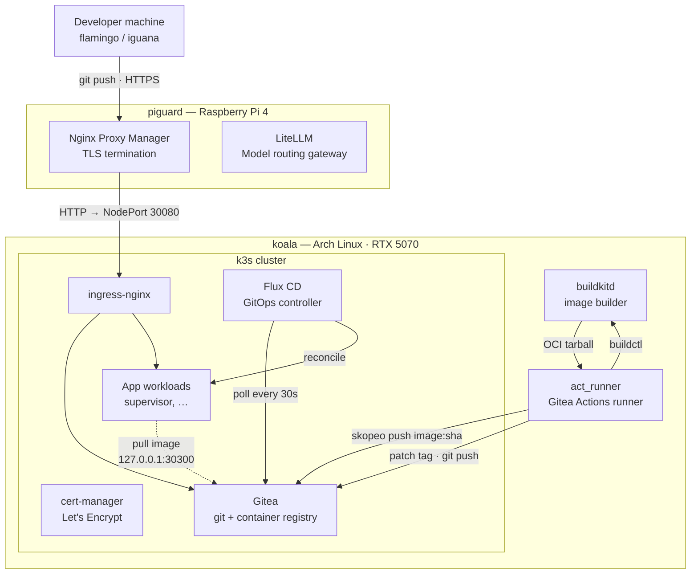
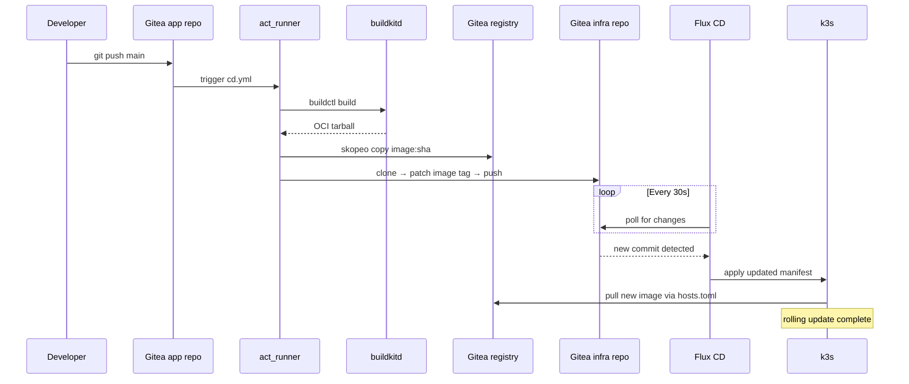

# GitOps at Home: A Production-Grade Self-Hosted CI/CD Pipeline with k3s, Gitea, and Flux

> A practical guide to building a complete GitOps pipeline on a homelab — from git push to running pod — with encrypted secrets, a private container registry, and zero reliance on cloud CI services.

---

## Why build this?

Cloud CI/CD is convenient until it isn't. GitHub Actions is free for public repos and affordable for small teams, but it falls apart for AI-heavy workloads: you can't run a 24 GB model in an Actions runner, you can't keep a GPU warm between jobs, and you can't keep proprietary training data off third-party infrastructure.

The goal here is a pipeline that:

- **Builds container images on your own hardware** — GPU, large memory, fast local storage
- **Stores images in a self-hosted registry** — your data stays home
- **Deploys via GitOps** — the cluster state is always derivable from git, no manual `kubectl apply`
- **Handles secrets properly** — encrypted in git, never in plaintext, decrypted only in-cluster
- **Costs nothing at the margin** — once the hardware exists, adding a new service is zero incremental cost

This guide documents the exact setup running in my homelab as of early 2026, including the non-obvious decisions and the problems that took days to debug.

---

## Architecture overview



**The flow for a code change:**



No manual steps. No cloud involvement. End-to-end in under two minutes.

---

## Hardware

| Machine | Role | Specs |
|---------|------|-------|
| **koala** | Compute, cluster, registry | RTX 5070, 64 GB RAM, Arch Linux |
| **iguana** | Dev machine, secondary compute | M2 Ultra Mac |
| **flamingo** | Daily driver | Mac mini |
| **piguard** | Gateway, proxy, LiteLLM | Raspberry Pi 4, 4 GB |
| **piblock** | Backup target | Raspberry Pi 4, 4 TB USB |

All machines are connected via **Tailscale** for a zero-config private mesh. LAN (10.0.1.0/24) is available for high-bandwidth traffic within the home.

---

## Component choices and why

### k3s over full Kubernetes

k3s is a single binary, installs in 60 seconds, and runs comfortably on a single node. Full k8s (kubeadm, etc.) would work but adds operational overhead with no benefit at this scale. k3s ships with containerd, CoreDNS, Traefik (replaced here with ingress-nginx), and Kine (SQLite backend) — everything you need for a single-node cluster.

**Why not Docker Compose?** GitOps is the answer. With k3s + Flux, the desired state lives in git. With Compose, you need to SSH in and run `docker compose pull && docker compose up -d`. That's a manual step that will eventually be forgotten or done inconsistently.

### Gitea over GitHub/GitLab

Gitea is lightweight (single Go binary + database), ships with a built-in container registry, and has Gitea Actions — a GitHub Actions-compatible CI system. For a homelab the value proposition is clear: one tool gives you git hosting, a package/container registry, and CI/CD runners.

GitLab would also work but is substantially heavier (dozens of services, 4+ GB RAM baseline).

**Why not just use GitHub?** The container registry is the deciding factor. Building an image on koala and pushing it to ghcr.io or Docker Hub means your image is on third-party infrastructure. For AI workloads that embed model weights or proprietary data in the image, that's not acceptable.

### Flux over Argo CD

Both are solid GitOps controllers. Flux is chosen here because:

- **Lighter weight**: Flux is a set of controllers, not a full application platform with a UI
- **SOPS integration**: Flux has first-class support for SOPS-encrypted secrets — it decrypts manifests at apply time using a key stored in the cluster
- **Pull-based**: Flux polls the git repo and applies changes. Nothing needs to reach into the cluster — no ingress rule required for the GitOps controller itself

### SOPS + age over Kubernetes Secrets in plaintext

Never commit plaintext secrets to git. SOPS (Secrets OPerationS) encrypts YAML files field-by-field, leaving the structure readable but values encrypted. age is the encryption backend — simpler than GPG, purpose-built for this use case.

The workflow: encrypt locally with the age public key (safe to store in the repo), commit the encrypted file, Flux decrypts at apply time using the age private key stored in a Kubernetes Secret.

### BuildKit + skopeo over Docker

**BuildKit** (`buildkitd`) is the build backend that powers `docker build` — but running it as a standalone daemon means you don't need the Docker daemon at all. BuildKit supports multi-stage builds, cache mounts, and outputs directly to OCI tarballs.

**skopeo** copies OCI images between locations. Here it's used to push the image tarball to the Gitea registry. The key advantage over `docker push`: skopeo uses simple `--dest-creds user:token` authentication, which avoids the OAuth token exchange flow that requires HTTPS throughout. This matters because the Gitea runner is on the same machine as the cluster — local network, HTTP internally, HTTPS only at the public boundary.

---

## Setup walkthrough

> The infra repo at `gitea.d-ma.be/mathias/infra` contains all manifests. This guide documents the manual and automated steps needed to go from a fresh Arch Linux install to a fully running cluster with CI/CD.

### Prerequisites

- Fresh Arch Linux install on koala (see `bootstrap/pre-bootstrap.md` for disk setup)
- Cloudflare account managing your domain's DNS
- Nginx Proxy Manager running on a gateway machine (or any reverse proxy with TLS termination)
- Tailscale account and authkey

### 1. Base system bootstrap

Clone the infra repo and run the bootstrap scripts. They are idempotent — safe to re-run if something fails midway.

```bash
sudo pacman -S git
git clone https://gitea.d-ma.be/mathias/infra.git ~/infra
cd ~/infra
bash bootstrap/run-all.sh
```

The scripts handle: package installation, system hardening, NVIDIA drivers, k3s install, Flux bootstrap, and backup configuration. Each prompts for secrets interactively — they are never stored in the scripts.

### 2. k3s

k3s is installed by `bootstrap/03-k3s.sh`. Key configuration choices:

- `--disable traefik` — replaced with ingress-nginx for better compatibility with standard annotations
- `--node-name koala` — explicit hostname for nodeSelector in pod specs
- kubeconfig written to `/etc/rancher/k3s/k3s.yaml` and symlinked to `~/.kube/config`

After install, verify:
```bash
kubectl get nodes
# NAME    STATUS   ROLES                  AGE   VERSION
# koala   Ready    control-plane,master   1m    v1.34.x
```

### 3. Gitea

Gitea is installed via Helm into the `gitea` namespace. It is deliberately **not** managed by Flux — see the design note below.

```bash
helm repo add gitea-charts https://dl.gitea.com/charts/
helm repo update
helm install gitea gitea-charts/gitea \
  --namespace gitea --create-namespace \
  -f k3s/apps/gitea/values.yaml
```

The values file configures:
- PostgreSQL as the database backend (bundled, not external)
- Persistent storage via `local-path` provisioner
- ingress-nginx ingress with TLS via cert-manager
- `REVERSE_PROXY_TRUSTED_PROXIES: "127.0.0.1,::1,10.0.0.0/8,172.16.0.0/12"` — required so Gitea generates `https://` realm URLs for container registry token exchange (see the containerd section)

After install, patch the live secret to match (Gitea re-reads its config on pod restart):
```bash
# Get current config, add/update REVERSE_PROXY_TRUSTED_PROXIES in the [server] section
kubectl edit secret gitea-inline-config -n gitea
kubectl rollout restart deployment/gitea -n gitea
```

**Expose Gitea SSH as a NodePort** so the CD runner can push to the infra repo via SSH:
```bash
kubectl apply -f k3s/apps/gitea/gitea-ssh-nodeport.yaml  # NodePort 30022
```

**Expose Gitea HTTP as a NodePort** for containerd to pull images directly (see containerd section):
```bash
kubectl apply -f k3s/apps/gitea/gitea-http-nodeport.yaml  # NodePort 30300
```

**Why not Flux-managed?** Flux reads its source of truth from Gitea. If Gitea goes down, Flux cannot read its config to restore Gitea — a circular dependency. On a single-node cluster there is no meaningful HA anyway; recovery always involves manual steps. Keeping Gitea manual avoids complexity without meaningful operational cost. The Helm values are in the infra repo as documentation for disaster recovery.

### 4. ingress-nginx and cert-manager

These are managed by Flux via HelmRelease manifests in `k3s/system/`. After Flux bootstraps, they apply automatically.

Cloudflare DNS: an A record for `gitea.d-ma.be` points to your home IP. cert-manager uses the HTTP-01 challenge via ingress-nginx to issue Let's Encrypt certificates. The certificate is stored as the `gitea-tls` Secret in the gitea namespace.

Nginx Proxy Manager on piguard forwards `gitea.d-ma.be` to `koala:30080` (HTTP NodePort). NPM terminates TLS from Cloudflare, then proxies to k3s over HTTP.

### 5. Flux CD

Flux is bootstrapped once, pointing at the infra repo:

```bash
flux bootstrap gitea \
  --owner=mathias \
  --repository=infra \
  --branch=main \
  --path=k3s/flux \
  --token-auth
```

This creates the `flux-system` namespace and installs Flux's controllers. The Flux manifests in `k3s/flux/` then take over — Flux watches the infra repo and reconciles everything else.

Verify:
```bash
flux get kustomizations
# NAME          READY   STATUS
# flux-system   True    Applied revision: main/abc123
# apps          True    Applied revision: main/abc123
```

### 6. SOPS secrets

Generate an age keypair:
```bash
age-keygen -o age.key
# Public key: age1...
```

Store the public key in `.sops.yaml` in the infra repo. **Store the private key in 1Password** — it is the master key for all cluster secrets.

Give Flux access to the private key for decryption:
```bash
kubectl create secret generic sops-age \
  --namespace=flux-system \
  --from-file=age.agekey=age.key
```

Encrypt secrets before committing:
```bash
sops --encrypt secret.yaml > secret.enc.yaml
git add secret.enc.yaml
# Never add the plaintext secret.yaml to git
```

### 7. BuildKit

BuildKit runs as a root systemd service on koala. The setup script is idempotent:

```bash
sudo REGISTRY_CREDS="mathias:<token>" bash scripts/buildkitd-setup.sh
```

This installs buildkitd, configures the socket with group permissions so the Gitea runner can use it without root, and writes registry credentials for pushing images.

Verify:
```bash
buildctl --addr unix:///run/buildkit/buildkitd.sock debug workers
```

### 8. Gitea Actions runner

The Gitea runner (`act_runner`) runs as a systemd service on koala under the `mathias` user. Registration:

```bash
act_runner register \
  --instance https://gitea.d-ma.be \
  --token <runner-token-from-gitea-ui> \
  --name koala \
  --labels self-hosted
```

The runner token is generated in Gitea → Site Admin → Actions → Runners. Copy the systemd unit from `scripts/act_runner.service`:

```bash
sudo cp scripts/act_runner.service /etc/systemd/system/
sudo systemctl enable --now act_runner
```

### 9. Org-level secrets

Set these once in Gitea at `https://gitea.d-ma.be/org/mathias/settings/secrets` — all repos in the org inherit them:

| Secret | Value | Purpose |
|--------|-------|---------|
| `REGISTRY_CREDS` | `mathias:<token>` | Push images to Gitea container registry |
| `INFRA_DEPLOY_KEY` | SSH private key | Allow CD runner to push to infra repo |

Generate the registry token in Gitea → User Settings → Applications → Generate Token (select `write:package`).

Generate the deploy key:
```bash
ssh-keygen -t ed25519 -f infra_deploy_key -C "cd-bot@d-ma.be"
# Add infra_deploy_key.pub as a deploy key with write access to the infra repo
# Add infra_deploy_key (private) as the INFRA_DEPLOY_KEY org secret
```

### 10. CD workflow

Each app repo gets a `.gitea/workflows/cd.yml`. The pattern:

```yaml
name: cd
on:
  push:
    branches: [main]

jobs:
  deploy:
    runs-on: self-hosted
    env:
      IMAGE: gitea.d-ma.be/mathias/<service>
    steps:
      - uses: actions/checkout@v4

      - name: Build and push image
        run: |
          IMAGE_TAG="${{ github.sha }}"
          buildctl --addr unix:///run/buildkit/buildkitd.sock build \
            --frontend dockerfile.v0 \
            --local context=. \
            --local dockerfile=. \
            --output type=oci,dest=/tmp/image.tar

          skopeo copy \
            oci-archive:/tmp/image.tar \
            docker://${IMAGE}:${IMAGE_TAG} \
            --dest-creds "${{ secrets.REGISTRY_CREDS }}"

      - name: Update infra repo
        run: |
          IMAGE_TAG="${{ github.sha }}"
          # Use NodePort SSH to reach Gitea from the runner (same machine as cluster)
          mkdir -p ~/.ssh
          echo "${{ secrets.INFRA_DEPLOY_KEY }}" > ~/.ssh/infra_deploy_key
          chmod 600 ~/.ssh/infra_deploy_key
          printf 'Host gitea.d-ma.be\n  HostName 127.0.0.1\n  Port 30022\n  StrictHostKeyChecking no\n' >> ~/.ssh/config

          GIT_SSH_COMMAND="ssh -i ~/.ssh/infra_deploy_key -o IdentitiesOnly=yes" \
            git clone git@gitea.d-ma.be:mathias/infra.git /tmp/infra-update

          cd /tmp/infra-update
          sed -i "s|${IMAGE}:.*|${IMAGE}:${IMAGE_TAG}|" k3s/apps/<service>/deployment.yaml

          git config user.email "cd-bot@d-ma.be"
          git config user.name "CD Bot"
          git add k3s/apps/<service>/deployment.yaml
          git commit -m "chore(deploy): <service> → ${IMAGE_TAG}"
          GIT_SSH_COMMAND="ssh -i ~/.ssh/infra_deploy_key -o IdentitiesOnly=yes" git push
```

**SSH via NodePort 30022**: the runner is on koala, the same machine as the k3s cluster. Going through the public DNS (piguard → k3s ingress) would add an HTTP round-trip. Instead, the SSH config overrides `gitea.d-ma.be` to connect to `127.0.0.1:30022` (the Gitea SSH NodePort) directly.

### 11. containerd registry configuration

This is the least-documented part of the setup and the most likely to break on a reinstall.

**The problem**: k3s v1.34 ships with containerd v2.x, which silently ignores the `mirrors` section in `/etc/rancher/k3s/registries.yaml`. The deprecation is noted in the containerd changelog but k3s's own documentation hasn't caught up. `k3s crictl info` will show a deprecation warning about the `configs` key and simply no mirror configuration despite a well-formed `registries.yaml`.

The fix is to use `hosts.toml` files in containerd's `config_path` directory instead.

**A second problem**: the obvious mirror target is the ingress HTTPS NodePort (`10.0.1.20:30443`). This doesn't work either. containerd connects to the mirror endpoint and sets the `Host` header to the mirror's address, not to `gitea.d-ma.be`. ingress-nginx uses the Host header for virtual host routing — `Host: 10.0.1.20:30443` matches no rule, so it returns 404.

**The fix**: expose Gitea HTTP directly as a NodePort (port 30300) and use that as the mirror. containerd connects to `127.0.0.1:30300`, which routes directly to the Gitea pod — no ingress involved, no Host header routing needed.

Run the fix script (requires sudo — writes to a root-owned path):
```bash
sudo bash ~/infra/scripts/fix-containerd-registry.sh
```

The script:
1. Finds `config_path` in containerd's generated `config.toml`
2. Writes `/var/lib/rancher/k3s/agent/etc/containerd/certs.d/gitea.d-ma.be/hosts.toml`:

```toml
server = "https://gitea.d-ma.be"

[host."http://127.0.0.1:30300"]
  capabilities = ["pull", "resolve"]
  [host."http://127.0.0.1:30300".header]
    Authorization = ["Basic <base64(user:token)>"]
```

3. Trims `registries.yaml` to remove deprecated gitea config
4. Restarts k3s

**Realm URL**: direct HTTP to the Gitea pod (no proxy headers) causes Gitea to use `ROOT_URL` as-is — `https://gitea.d-ma.be/v2/token`. This is an HTTPS URL, so containerd will use the imagePullSecret credentials for the OAuth token exchange. The pull succeeds.

**Persistence**: k3s does not manage the `certs.d` directory for registries absent from `registries.yaml`. The `hosts.toml` file survives k3s restarts.

### 12. Adding a new service

With the infrastructure in place, adding a service is four steps:

1. **Add manifests** to `k3s/apps/<service>/` in the infra repo: `namespace.yaml`, `deployment.yaml`, `service.yaml`, `kustomization.yaml`
2. **Add to the apps kustomization**: `k3s/apps/kustomization.yaml`
3. **Encrypt app secrets**: `sops --encrypt secrets.yaml > secrets.enc.yaml`, commit
4. **Add `cd.yml`** to the app repo — copy from supervisor, adjust service name

Flux reconciles within 30 seconds of the infra repo push. The CD pipeline fires on the first push to the app repo's `main` branch.

---

## Environment variables on koala

After reinstall, restore these to `/etc/environment` (loaded by PAM — available to all sessions and services):

| Variable | Purpose |
|----------|---------|
| `ANTHROPIC_API_KEY` | Claude API |
| `DMABE_LLMAPI_KEY` | LiteLLM gateway key |
| `GEMINI_API_KEY` | Google Gemini |
| `MISTRAL_API_KEY` | Mistral |
| `BERGET_API_KEY` | berget.ai inference |

Values are in 1Password. After editing `/etc/environment`, re-login or `sudo systemctl restart act_runner` for services to pick up the new values.

---

## Disaster recovery checklist

If koala needs to be rebuilt from scratch:

1. **Reinstall Arch Linux** per `bootstrap/pre-bootstrap.md`
2. **Clone infra repo**: `git clone https://gitea.d-ma.be/mathias/infra.git ~/infra`
   - If Gitea is also gone: bootstrap Gitea manually from Helm first, restore from restic backup, then clone
3. **Run bootstrap scripts**: `bash bootstrap/run-all.sh` (prompts for secrets)
4. **Restore age private key** from 1Password → create `sops-age` secret in flux-system
5. **Bootstrap Flux**: `bash bootstrap/04-flux.sh`
6. **Install Gitea manually** (not Flux-managed): `helm install gitea ...` per step 3 above
7. **Patch gitea-inline-config secret** with `REVERSE_PROXY_TRUSTED_PROXIES`
8. **Apply Gitea NodePort services**: `kubectl apply -f k3s/apps/gitea/`
9. **Run containerd fix**: `sudo bash scripts/fix-containerd-registry.sh`
10. **Restore `/etc/environment`** API keys from 1Password
11. **Register act_runner** with a fresh token from Gitea UI
12. **Verify**: push a trivial change to a service repo, watch the pipeline run

---

## What works well

- **Zero-touch deploys**: push code, pod updates. No SSH, no manual apply.
- **Encrypted secrets in git**: the infra repo is fully public-safe. Secrets are opaque blobs.
- **Rollback**: `git revert` + push. Flux reconciles within 30 seconds.
- **Cost**: the only ongoing cost is electricity. No cloud CI minutes, no registry storage fees.
- **Portability**: the entire cluster state is in git. Rebuilding from scratch follows this guide.

## What to watch

- **Gitea is not Flux-managed**: if koala dies, Gitea needs manual reinstall before Flux can do anything. This is an acceptable tradeoff for a single-node setup.
- **containerd hosts.toml**: the fix script needs to be re-run after a k3s reinstall. It's in the infra repo — one `sudo bash` command.
- **Single node**: there's no HA. If koala is down, everything is down. For a homelab this is fine; for production workloads, add more nodes.
- **Registry retention**: set a cleanup rule in Gitea → Admin → Packages → Cleanup Rules. Type: Container, keep last 5 versions. Without this, image tags accumulate indefinitely.

---

## Appendix: key file locations on koala

| Path | Purpose |
|------|---------|
| `/etc/rancher/k3s/registries.yaml` | containerd registry config (mirrors, deprecated) |
| `/var/lib/rancher/k3s/agent/etc/containerd/certs.d/` | hosts.toml per registry |
| `/etc/buildkit/buildkitd.toml` | BuildKit config |
| `/root/.docker/config.json` | BuildKit push credentials |
| `/etc/environment` | API keys and env vars (PAM-loaded) |
| `~/.kube/config` | kubeconfig (symlink to /etc/rancher/k3s/k3s.yaml) |
| `/var/lib/supervisor/brain/` | Supervisor app persistent data (hostPath volume) |
